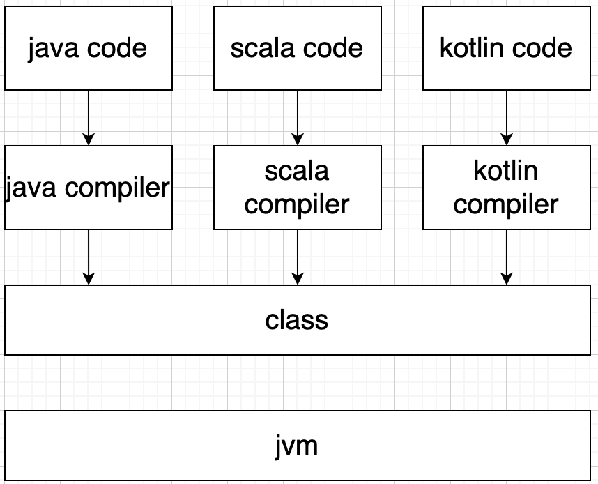

### Kotlin Java Scala相互调用探索

理论上来说,只要是jvm上的语言,都是可以`直接`相互调用的,因为它们最终都是被各自的编译器编译成了字节码然后运行在jvm上.

但是,理论很美好,现实很骨感.无论是kotlin还是scala,亦或是其他jvm语言,为了自己语言的特点(例如scala良好的函数式编程支持,kotlin的协程等等),除了java之外的其他jvm的编译器在编译时候总是"动手动脚",相比之下由于字节码的编码方式几乎都是与java语法一一对应的,所以java的编译器非常老实,在编译期几乎没有什么"花花肠子",这就为它们之间相互调用制造了一些隔阂.

例如:

1. data class/case class的copy方法:

- scala -> kotlin : 可以访问 但是没有默认参数的功能

- kotlin -> scala: 可以访问 但是没有默认参数的功能

无论是kotlin还是scala 自定义的含有默认参数的方法都是在编译期做的手脚(其他语言都无法使用),kotlin提供了注解生成重载方法

2. 伴生对象:

- scala -> kotlin: kotlin的伴生对象中的普通方法无法被访问,被`@JvmStatic`标记的方法可以正常访问

- kotlin -> scala: 可以正常访问

3. 拓展方法:

- scala -> kotlin: 直接使用`文件名Kt`.`方法名` 调用,调用时需要传入参数
- kotlin -> scala: scala2不支持拓展方法

4. 高阶函数:

- scala -> kotlin: 直接调用,除了Unit需要适配之外,其他的类型都很容易匹配
- koltin -> scala: 直接调用,但是scala的泛型如果不是java类型就都会被识别成Any

普通语法层面的隔阂其实只要稍微熟悉一下被调用的jvm语言的一些编译规则,就可以轻松相互调用,虽然像含有默认参数的方法调用时会受到一定的限制,但是这都是完全可以解决或者绕过的. 甚至在不熟悉被调用语言的情况下,借助IDE的也能很好的打破隔阂.

其实,jvm上的语言真正的隔阂在于运行时类的表现差异很大.对,说的就是**反射**.像上述例子,不管如何我们总是能较为轻松的找到解决方案,但是如果被调用方语言的方法实现过程中有通过反射做某些事情,那情况立马就不一样了. 例如kotlin的data class在kotlin的反射包中是有专有描述的(dataClaz.isData),而使用scala编写的项目除非有额外的特殊处理,否则一般不会有人去考虑处理kotlin class的反射,这样就会造成使用kotlin调用这些方法的时候出现意想不到的错误结果